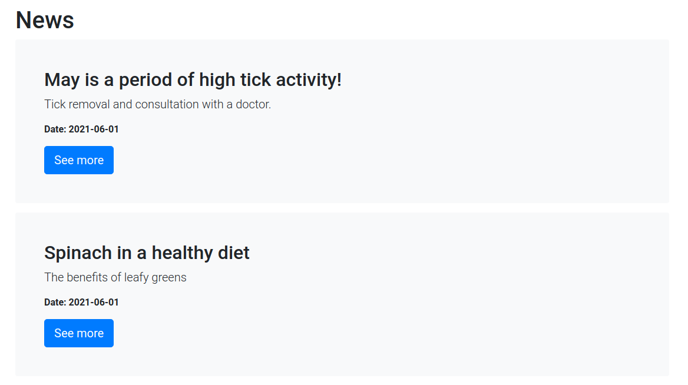
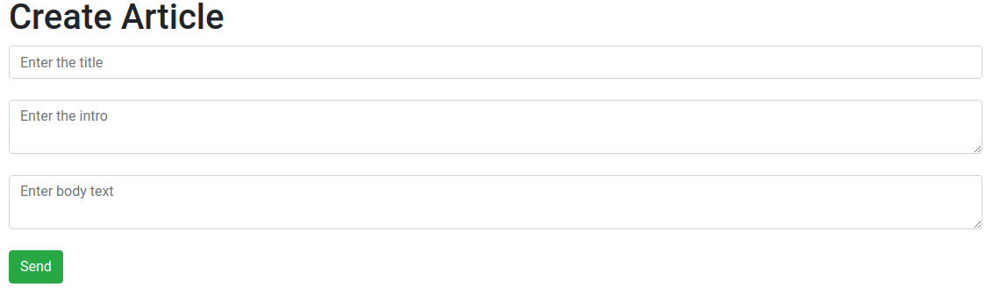
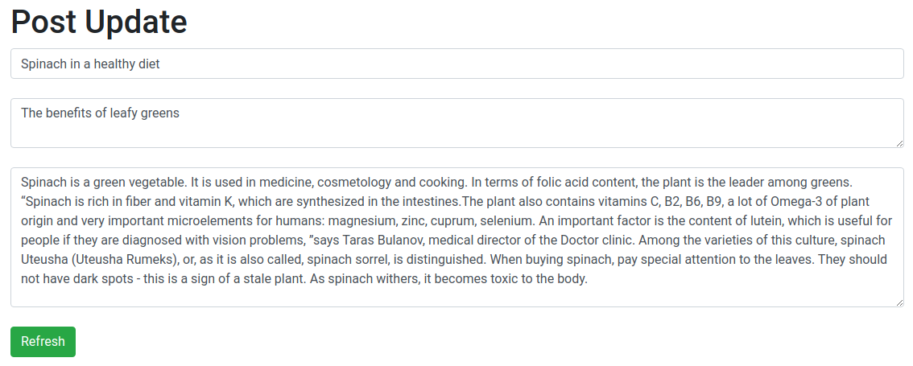
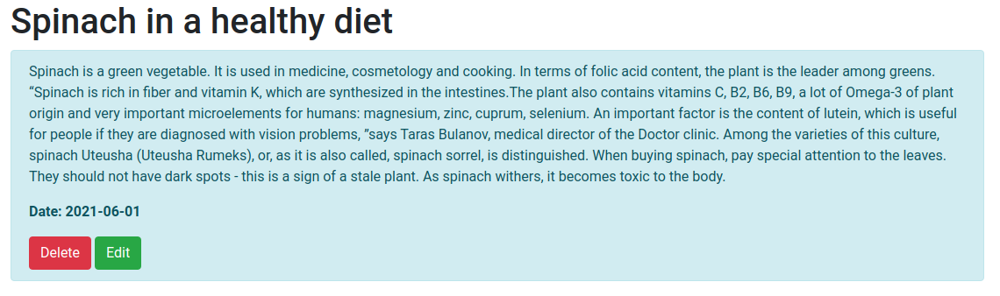
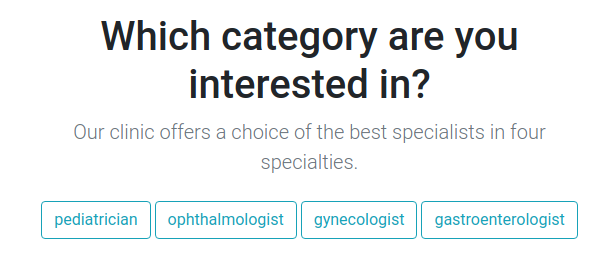
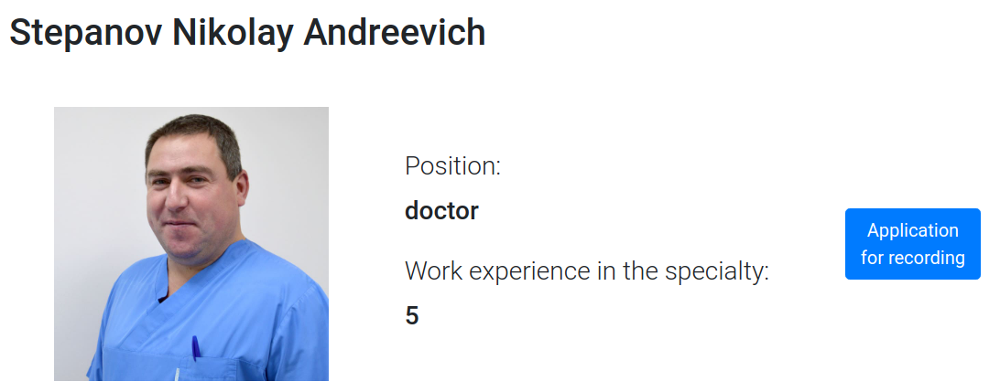
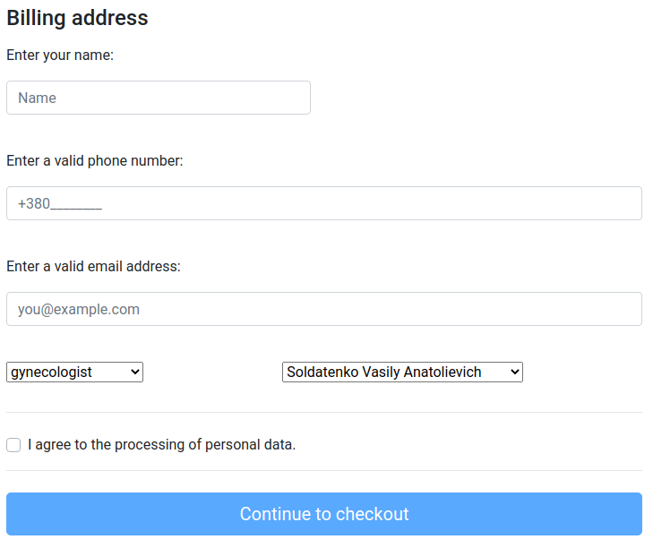

# TheDoctor

## Vision
This project provides an opportunity for clients of the clinic to familiarize themselves with the list of
services / specialists provided and apply for an appointment. You can also read the news.

Application should provide:
* View the list of news.
* View specific news.
* Delete news.
* Adding news.
* Change news.
* View a list of doctors with the ability to sort by specialty.
* View information about a specific doctor.
* The ability to apply for an appointment with a specific doctor.

## 1. News
### 1.1 Display list of news
The mode is intended for viewing the list of news if the list is not empty.

***Main scenario:***
* User selects item “News”;
* Application displays list of News.

Pic. 1.1 View the News list.

The button(See more) allows you to view detailed information about specific news.

### 1.2 Add News
***Main scenario:***
* Click on the button 'Create Article';
* Fill in the appropriate information in the fields: 'Enter the table', 'Enter the fio', 'Enter body text';
* Click on the button 'Send';
* If you were transferred to the page with all the news, the operation was successful, otherwise not.

Pic. 1.2 Add news.

### 1.3 Edit News
***Main scenario:***
* Click on the button 'News';
* Click on the button 'See more';
* Click on the button 'Edit';
* Fill in the appropriate information in the fields: 'Enter the table', 'Enter the fio', 'Enter body text';
* Click on the button 'Refresh';
* If you were transferred to the page with all the news, the operation was successful, otherwise not.

Pic. 1.3 Edit news

### 1.4 Delete the news
***Main scenario:***
* Click on the button 'News';
* Click on the button 'See more';
* Click on the button 'Delete';
* If you were transferred to the page with all the news, the operation was successful, otherwise not.

Pic. 1.4 Delete news.

## 2. Doctor
### 2.1 Display list of doctors
The mode is intended for viewing the list of doctors if the list is not empty.
***Main scenario:***
* User selects item “Doctors”;
* Application displays list of Doctors.

Pic 2.1 View the doctors list.

***Filter by date:***
* In the mode of viewing the list of clients, the user sets the specialty filter (fig. 2.1);
* The application will show clients only specialists in this specialty.

Pic. 2.1 Choose specialty.

### 2.2 About a specific doctor
***Main scenario:***
* User selects item “Doctors”;
* Application displays list of Doctors;
* User selects item “See more”;
* Application shows detailed information about the doctor.

Pic. 2.2 Specific doctor

## 3. Application for recording
The mode is designed to apply for an appointment with a specific doctor.
***Main scenario:***
* User selects item “Application for recording”;
* Fill in all the fields provided;
* Check the box as a sign that you agree to the processing of personal data;
* User selects item "Continue to checkout".

Pic. 3.1 Application for recording

